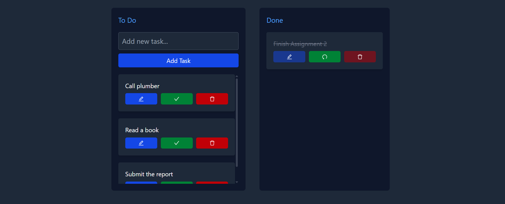

# Modern Todo List Application

A simple modern Todo List application built with React, Express.js, and a dark theme UI. Features real-time updates and persistent storage.



## Features

- Modern dark theme UI
- Responsive design
- Persistent storage with JSON file
- Complete/Uncomplete tasks
- Edit task descriptions
- Delete tasks
- Real-time updates
- Separate "To Do" and "Done" lists

## Technology Stack

- Frontend:
  - React
  - Tailwind CSS
  - React Icons
  - Vite (Build tool)
- Backend:
  - Express.js
  - Node.js
  - File System for persistence

## Getting Started

### Prerequisites

- Node.js (version 14 or higher)
- npm (comes with Node.js)

### Installation

1. Clone the repository
```powershell
git clone https://github.com/moontrovert/React-ToDone.git
cd todoList
```

2. Install dependencies
```powershell
npm install
```

3. Start the backend server
```powershell
npm run server
```

4. In a new terminal, start the frontend development server
```powershell
npm run dev
```

5. Open your browser and navigate to `http://localhost:5173`

## Usage

- **Add a Task**: Enter task description in the input field and click "Add Task"
- **Edit a Task**: Click the edit (pencil) icon to modify a task
- **Complete/Uncomplete**: Click the check/undo icon to toggle task completion
- **Delete**: Click the delete (trash) icon to remove a task
- **View Tasks**: Tasks are automatically sorted into "To Do" and "Done" lists

## API Endpoints

The backend provides the following REST API endpoints:

- `GET /tasks` - Retrieve all tasks
- `POST /tasks` - Create a new task
- `PUT /tasks/:id` - Update a task by ID
- `DELETE /tasks/:id` - Delete a task by ID

## Development

### Project Structure
```
todoList/
├── server/
│   └── index.js         # Express server configuration
├── src/
│   ├── components/
│   │   ├── list.jsx     # List component for todo/done lists
│   │   └── taskCard.jsx # Individual task component
│   ├── App.jsx          # Main application component
│   ├── data.json        # Data persistence file
│   └── global.css       # Global styles
└── package.json         # Project dependencies and scripts
```
